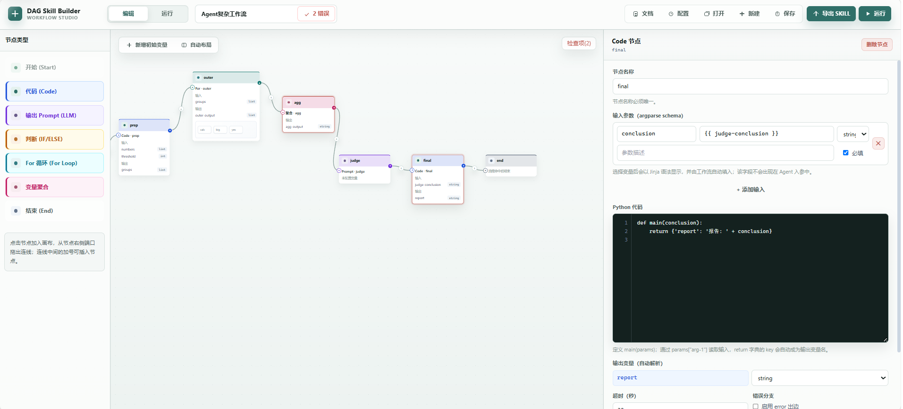
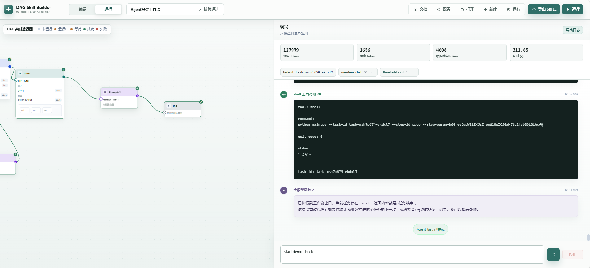

# fsm to skill · DAG 工作流编排到 Skill 导出引擎

> 让大模型回归“推理”本职，将“流程控制”交还给经典而严谨的有限状态机（FSM）。

> 基于状态机（FSM）的完全本地化、轻量级 的SKILL编排与生成工具。


[English](./README.en.md) · [使用文档](./static/docs.html) · [License](./LICENSE)

---

## 界面预览





---

## 为什么选择 fsm to skill

fsm to skill 是一个**完全本地运行**的工作流编排工具：纯前端画布 + Python 后端引擎。你通过拖拽节点构建有向无环图（DAG），接入真实 Agent 在线调试，跑通后一键导出为标准 Skill 目录，供任何支持命令行交互的 Agent 加载使用。


当 Agent Skill 变得复杂...

**流程失控与幻觉**：
复杂的 Skill 往往包含各种分支判断和流程约束。随着冗余和冲突描述的增加，AI 越改越费力。Skill 越庞大和复杂，越容易诱发大模型的奖励黑客行为和逻辑幻觉。

**维护成本**:
复杂的 Skill 没有清晰的逻辑边界。 一旦业务逻辑发生变更，面对成百上千行的 Prompt，开发者难以进行有效的维护和迭代。 AI 越改越费力，SKILL越改越庞大。

**关键约束被遗忘**:
执行链路一旦过长，LLM注意力就会分散，导致重要约束被忽略。 例如，当要求逐个执行100个相似但复杂的任务时，大模型往往无法逐个严谨地完成任务，容易发生遗漏关键约束或跳过步骤。


fsm to skill解决的痛点: 

- 复杂推理流程散落在多次手写 prompt 里，难以复用、难以组合。
- 想让 LLM Agent 具备「多步、可分支、可循环、可计算」的确定性流程能力，却不想写状态机。
- SKILL 编写完成后，调试不透明，不知道在哪一步发生便宜。
- 编排结果难以沉淀为可分享、可版本化的 Skill 资产。

---

## 核心特性

- **完全本地**：无云端依赖，数据与密钥仅保存在本机。
- **7 种节点**：`start / code / llm / if / for / aggregate / end`，覆盖编排所需的基本能力。
- **可视化编排**：拖拽建连、实时校验、一键定位错误节点。
- **真实 LLM 调试**：可视化暂时运行流程。 统计流式输出、Token 统计、节点级变量快照。
- **一键导出 Skill**：生成 `SKILL.md`、`agent_interface.json`、`workflow.yaml`、`inference/`、`scripts/`。
- **状态机驱动**：导出的 `scripts/main.py` 是自包含状态机线程，Agent 只需执行一条命令即可进入 DAG。
- **结构校验**：无环、单开始、变量可追溯、类型匹配、禁嵌套 For 等。
- **替换转换skill**: 将已经编写好的复杂业务流程skill转换为 fsm skill，支持在应用中打开。
- **稳定性保障**: code执行错误处理 、 节点重试次数 、状态机等待超时配置等。

---

## 步骤

### 环境要求

- Python **3.10+**（推荐 3.12+）

### 安装

```bash
# 1. 克隆仓库
git clone https://github.com/<your-name>/fsm-to-skill.git
cd fsm-to-skill

# 2. 创建虚拟环境（可选但推荐）
python -m venv .venv
# Windows
.venv\Scripts\activate
# Linux / macOS
source .venv/bin/activate

# 3. 安装依赖
pip install -r requirements.txt

# 4.（可选）开发 / 运行测试依赖
pip install -r requirements-dev.txt

```

### 启动

```bash
python run.py
```

启动后浏览器自动打开 `http://localhost:8000`（默认端口，可在 `run.py` 中调整）。

---

## 快速上手

1. **配置**：在「配置」页填写服务商 `base_url` 与 `api_key`、设置默认模型；如需运行 Code 节点可指定 Python 解释器路径。
2. **编排**：在编辑页画布中，点击/拖拽左侧组件到画布；点击节点右侧 `+` 追加后继节点，从 `+` 拖拽到目标输入端口建立连线。
3. **配置节点**：选中节点，在右侧面板完成参数配置；工具栏「校验」随时检查结构错误。
4. **运行**：切到「运行」页，填写开始节点声明的输入变量，点击 ▶ 运行，实时观察各节点状态。
5. **导出**：校验通过后「导出 SKILL」，生成 Skill 目录供 Agent 使用。

---

## 节点类型

| 节点 | 说明 |
| --- | --- |
| **start** | 每个工作流DAG 入口，声明初始变量（string/int/float/list/dict）。 |
| **code** | 子进程执行 Python。输入为 argparse 风格参数 schema，代码统一定义 `main(params)`，返回字典自动成为输出变量。 |
| **llm** | 渲染 Prompt（Jinja2，`{{ 变量 }}`）。引擎内不调用模型，作为 Agent 出口返回消息。 |
| **if** | 条件分支：多条 IF 条件以 AND/OR 组合，仅 `if`/`else` 两条出边。 |
| **for** | 对 list 变量逐项迭代，子画布编排循环体；局部变量 `index/item/len/total`。 |
| **aggregate** | 汇聚多个成功上游，按类型合并（string 拼接 / 数值求和 / list 连接 / dict 合并）。 |
| **end** | 任一 end 命中即整个工作流立即终止，适合错误分支提前收尾。 |

### Code 节点示例

```python
def main(params):
    value = params["arg-1"]
    return {
        "result": value.upper(),
        "length": len(value),
    }
```

---

## 运行与调试

- **实时状态**：节点四色标识 —— 橙=运行中、绿=成功、红=失败、灰=跳过。
- **节点详情**：查看 Prompt、思考过程、stdout/stderr、错误信息与产出变量。
- **统计**：总耗时、各状态节点数、LLM 调用次数与 Token 用量、变量快照。
- **日志**：全部引擎事件流，可「导出日志」为 UTF-8 文本。
- **单节点调试**：Code 节点可单独输入参数运行，快速验证脚本逻辑。

---

## 导出 SKILL

校验通过后，选择目标目录一键导出：

```
my-skill/
├── SKILL.md              # 说明文档（入参表 / 输出 / 结构）
├── agent_interface.json  # Agent 到 Code / Prompt 的路由表
├── workflow.yaml         # 工作流定义
├── inference/            # LLM 提示词模板
└── scripts/              # Code 节点脚本 + 自动生成的 main.py 状态机入口
```

---

## Agent / Code / Prompt 交互模型

- `scripts/main.py` 是导出 Skill 的总状态机线程；每个 **Code 节点是 Agent 输入进入 DAG 的独立入口**，每个 **Prompt 节点是 DAG 输出返回 Agent 的出口**。
- **code 节点 = 入口**: 总线程由入参路由到各个code节点的入口并执行。
- **Prompt 节点 = 出口**：引擎运行到 Prompt 节点即暂停，把渲染后的字符串返回给 Agent；Agent 的下一次调用再从一个 Code 节点进入。

Agent 调用方式：

```bash
python main.py --task-id task-001 --step-id code-1 --step-param '{"arg-1":"hello"}'
```

- `--task-id`：标识同一次任务。
- `--step-id`：本次输入要进入哪个 Code 节点。
- `--step-param`：入参 JSON 字符串。

状态机继续执行 DAG，直到遇到 Prompt 出口并把渲染后的字符串返回给 Agent。

---

## 项目结构

```
fsm-to-skill/
├── app/                    # 后端源码
│   ├── engine/             # DAG 状态机执行引擎
│   ├── services/           # 调试服务、Agent 运行时、配置存储等
│   ├── validator/          # 19 项结构校验
│   └── web/                # 路由 / API
├── static/                 # 纯静态前端（画布、运行、配置界面）
│   ├── index.html          # 主界面
│   ├── docs.html           # 使用文档
│   └── js/ css/
├── data/
│   ├── config.yaml         # 本地配置（含 LLM api_key，已 gitignore）
│   └── workflows/          # 示例工作流
├── trans-fsm-skill/        # 预制skill,将已经编写好的skill转成fsm skill
├── work/                   # 运行产物/调试脚本（已 gitignore）
├── main.py                 # FastAPI 入口
├── run.py                  # 启动脚本
├── requirements.txt        # 运行依赖
├── requirements-dev.txt    # 测试依赖
├── README.md
└── LICENSE
```

---

## License

[MIT](./LICENSE)# fms-to-skill
